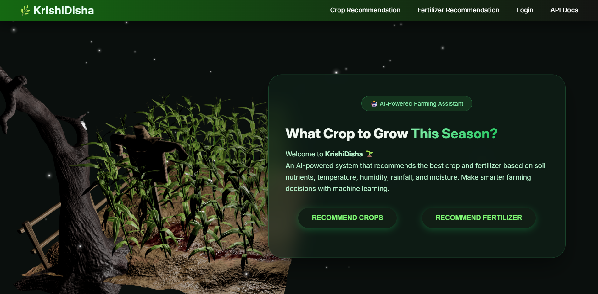

# 🌾 KrishiDisha – Smart Agriculture Recommendation System

KrishiDisha is an AI-powered web application that helps farmers make data-driven decisions by recommending 
suitable crops and fertilizers based on soil and environmental conditions.

---

## 🚀 Features

* 🌱 **Crop Recommendation** using Machine Learning (LightGBM)
* 🧪 **Fertilizer Recommendation System**
* 🤖 **AI Chatbot** for agriculture-related queries
* 🌦 **Weather Integration** (auto-fetch temperature, humidity, rainfall)
* 🔐 **User Authenticaion** (Login/Signup)
* 📊 **Interactive UI** built with React
* ⚡ Fast and accurate predictions

---

## 🛠 Tech Stack

### 🔹 Frontend

* React (Vite)
* CSS / Tailwind
* React Router

### 🔹 Backend

* FastAPI (Python)
* Node.js + Express (Chatbot Backend)

### 🔹 Machine Learning

* LightGBM
* Scikit-learn
* Pandas, NumPy

### 🔹 Database

* MongoDB

---

## 📁 Project Structure

```
KrishiDisha/
│
├── Frontend/           # React frontend
├── Backend/            # FastAPI ML backend
├── ChatbotBackend/     # Node.js chatbot server
├── README.md
└── .gitignore
```

---

## ⚙️ Setup Instructions

### 🔹 1. Clone Repository

```
git clone https://github.com/Manojyadav72/KrishiDisha.git
cd KrishiDisha
```

---

### 🔹 2. Setup Frontend

```
cd Frontend
npm install
npm run dev
```

---

### 🔹 3. Setup Backend (ML API)

```
cd Backend
pip install -r requirements.txt
uvicorn app:app --reload
```

---

### 🔹 4. Setup Chatbot Backend

cd ChatbotBackend
npm install
npm run dev


---

## 🔐 Environment Variables

Create `.env` files (DO NOT upload to GitHub)

### Example:

```
OPENAI_API_KEY=your_api_key_here
VITE_WEATHER_API_KEY=your_api_key_here
```

---

## 📸 Screenshots

### 🏠 Home Page


### 🔐 Signup Page


### 🔑 Login Page


### 🌾 Crop Recommendation Page


### 📊 Crop Result Page


### 🧪 Fertilizer Recommendation Page


### 🌿 Fertilizer Result Page


### 🌦 Weather Dashboard


### 📈 Mandi Price Finder


### 🤖 AI Chatbot


---

## 🎯 Use Case

* Helps farmers choose the best crop based on soil data
* Suggests fertilizers for better yield
* Provides AI assistance for farming queries

---

## 📈 Future Scope

* 📱 Mobile App version
* 🌍 Multi-language support
* 🌐 IoT integration for real-time soil data
* 📊 Advanced analytics dashboard

---

## 👨‍💻 Author

**Manoj Yadav**
MCA Student | Full Stack Developer

🔗 GitHub: https://github.com/Manojyadav72

---

## ⭐ Contribute

Contributions are welcome! Feel free to fork and improve the project.

---

## 📜 License

This project is for educational purposes.
